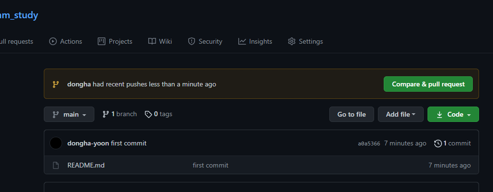
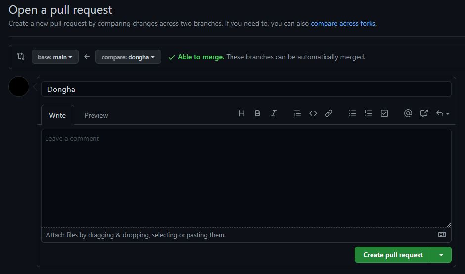
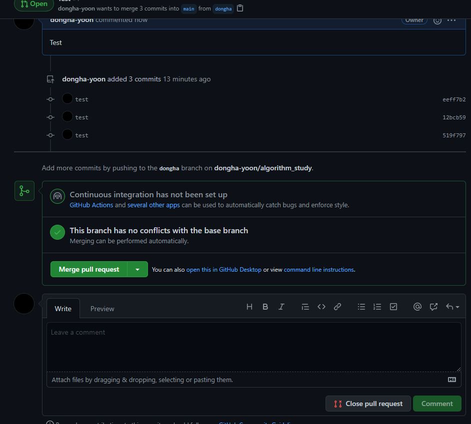

# algorithm_study

* 일단 자기 이름 폴더 만들어 주세요!

## 시작하기
1. 원하는 폴더에서 git clone
```bash
git clone https://github.com/dongha-yoon.git
```

2. 본인 branch 생성하기
```bash
git checkout -b <브랜치 이름>
# ex) git checkout -b dongha
```
3. 자기 이름으로 폴더 생성 후 코드 작성


## PR (pull request) 작성법
```bash
git add --all #작성한 코드 git에 반영
git commit -m "커밋 메세지" #코드 커밋
git push origin <브랜치 이름> #코드를 github에 업로드
```

1. 코드 push후 github 프로젝트 코드 페이지에서 **Compare & pull request** 클릭

{: width="500" height="300}

2. 제목(어떤 문제 풀었는지), 내용(어떻게 풀었는지) 작성 후 **Create pull request**작성

{: width="500" height="300}

3. 피드백 주고 받기 후 Merge

{: width="500" height="300}